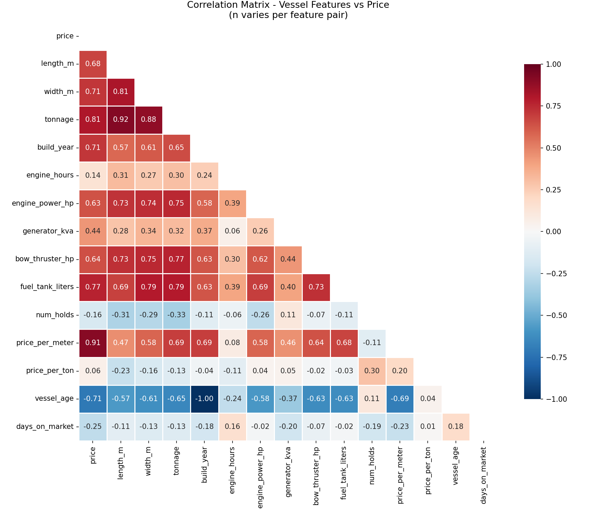
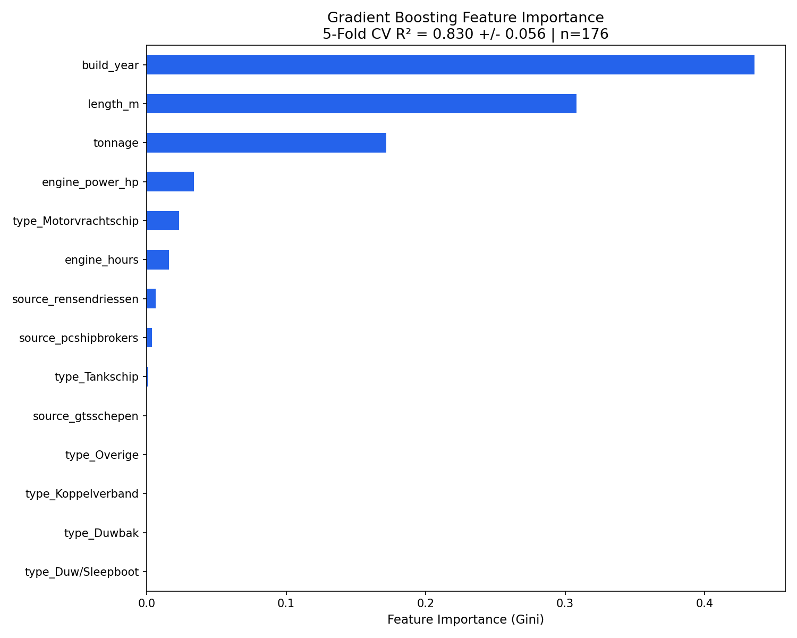
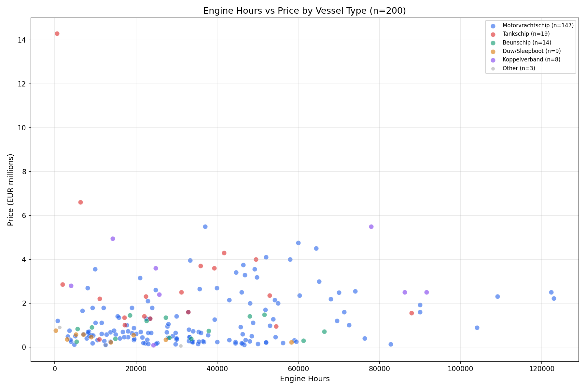
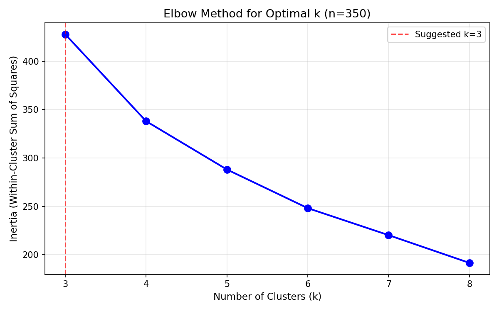
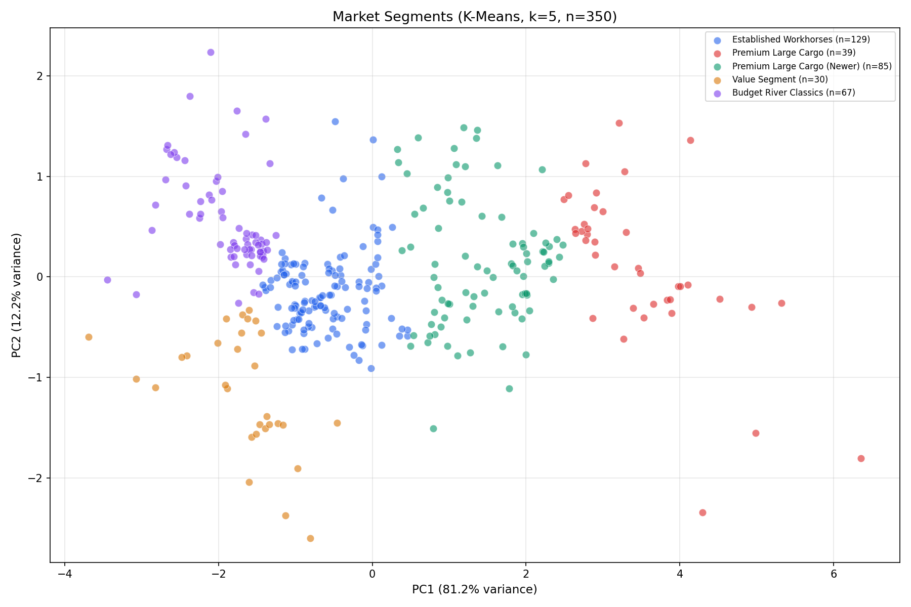
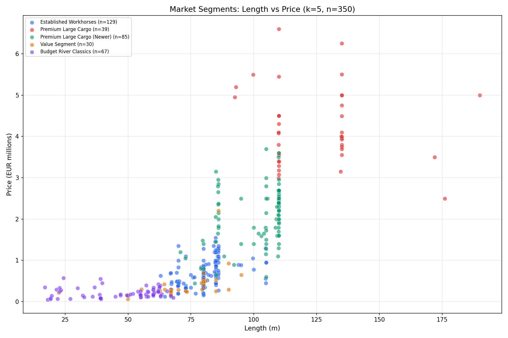
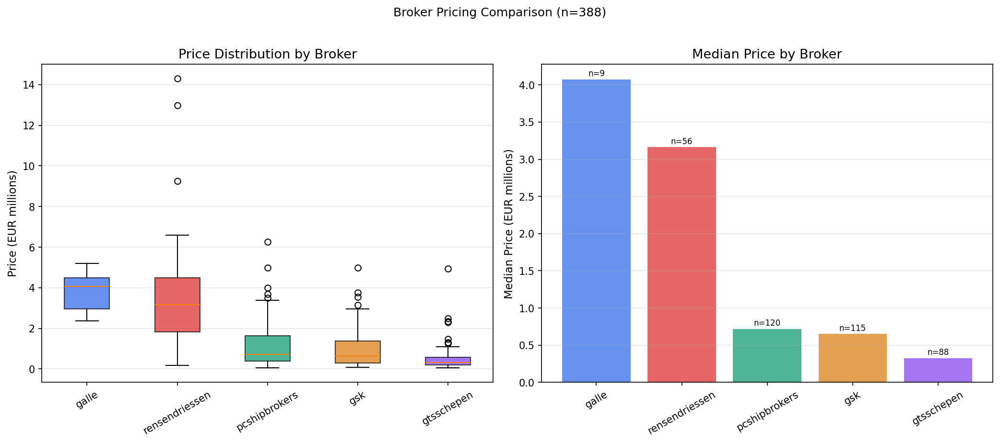
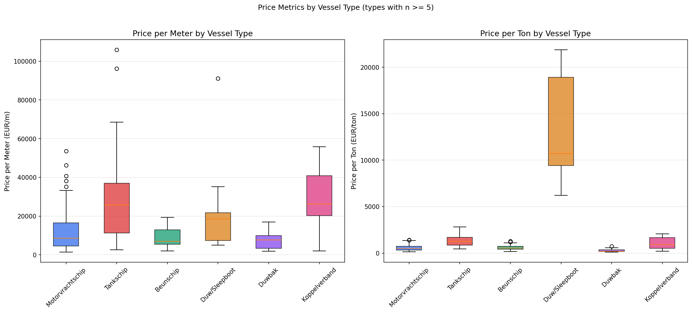
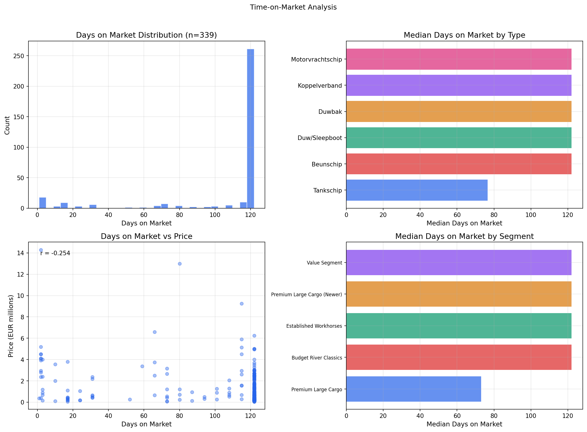

# Binnenvaart Intel - Market Analysis Report

**Date**: 2026-02-08
**Dataset**: 756 vessel listings from 5 broker sources, 391 priced and deduplicated

---

## 1. Executive Summary

- **Per-type models dramatically outperform pooled models**: A Motorvrachtschip-specific GBM achieves R^2 = 0.93 (vs pooled 0.74), because removing type noise reveals that tonnage is nearly as important as build year within type.
- **Tanker premium is real and large**: Tankschip command 2.5x more per ton than Motorvrachtschip (median 1,273 vs 516 EUR/ton). A type-blind model systematically misprices tankers. Engine hours also matter 20x more for tankers (-143K vs -7K per 10K hours).
- **Type-aware deal scoring reclassifies 36% of vessels**: Switching from a single pooled formula to per-type coefficients moves 115 of 323 scored vessels into a different deal bucket. Tankers that looked "overpriced" against cargo norms are actually "fair" within tanker norms.
- **Motorvrachtschip splits into 3 clear sub-segments**: Modern Large Cargo (44 vessels, avg 3.1M, 117m), Established Fleet (52, avg 1.3M, 97m), and Classic Rhine Freighters (130, avg 424K, 72m).
- **Brokers do not systematically over- or underprice**: Of 37 multi-listed vessels, most show identical prices across brokers. Sellers set the price; brokers reflect it.
- **Data quality is strong for core fields but weak for engine data**: Core fields (length, width, tonnage, build_year) have 90-100% coverage. Engine hours sit at 46%, engine power at 61%, making these detail-page features only.

**Bottom line**: The frontend should use type-aware deal scoring (per-type regression coefficients for Motorvrachtschip and Tankschip, pooled fallback for others). Engine hours should be highlighted for tankers. Within-type Motorvrachtschip segments enable more meaningful browsing and comparison.

---

## 2. Data Quality Assessment

### Field Coverage by Source

| Field | Galle | GSK | GTS Schepen | PC Shipbrokers | Rensen Driessen | Total |
|---|---|---|---|---|---|---|
| **price** | 72.0% | 53.0% | 64.2% | 76.1% | 78.0% | **65.7%** |
| **length_m** | 100% | 100% | 98.9% | 100% | 100% | **99.7%** |
| **width_m** | 96.0% | 100% | 98.9% | 100% | 100% | **99.6%** |
| **tonnage** | 100% | 91.6% | 92.6% | 96.8% | 62.2% | **90.5%** |
| **build_year** | 96.0% | 99.6% | 97.2% | 100% | 70.7% | **95.9%** |
| engine_hours | 0% | 42.6% | 48.3% | 51.8% | 46.3% | **45.6%** |
| engine_power_hp | 0% | 64.9% | 73.9% | 55.0% | 52.4% | **60.6%** |
| engine_make | 0% | 66.9% | 73.9% | 64.0% | 64.6% | **65.2%** |
| generator_kva | 36.0% | 64.5% | 68.2% | 59.0% | 48.8% | **61.1%** |
| fuel_tank_liters | 0% | 0% | 63.6% | 60.8% | 40.2% | **37.0%** |
| num_holds | 60.0% | 54.2% | 66.5% | 0% | 0% | **35.4%** |

### Data Completeness Score per Source

| Source | Core Fields (5) | Extended Fields (6) | Overall |
|---|---|---|---|
| **PC Shipbrokers** | 94.2% | 48.5% | 68.7% |
| **GTS Schepen** | 90.4% | 61.2% | 74.0% |
| **GSK** | 88.8% | 48.8% | 66.2% |
| **Rensen Driessen** | 82.2% | 43.0% | 59.9% |
| **Galle** | 92.8% | 16.0% | 47.8% |

**Key**: Core = price, length_m, width_m, tonnage, build_year. Extended = engine_hours, engine_power_hp, engine_make, generator_kva, fuel_tank_liters, num_holds.

### Key Anomalies

**Missing Build Year (31 vessels)**
Concentrated in Rensen Driessen (15 of 31), suggesting their API may omit `build_year` for certain listing types. Also affects 3 GTS Schepen listings and 1 Galle listing.

**Price Outliers (3 vessels, z-score > 3 on price/ton)**

| Vessel | Source | Price | Tonnage | Price/Ton |
|---|---|---|---|---|
| Wendy | PC Shipbrokers | 3,650,000 | 1,750t | 2,086 |
| Pelagus | Rensen Driessen | 3,850,000 | 2,505t | 1,537 |
| Porthos | PC Shipbrokers | 2,400,000 | 1,500t | 1,600 |

These are premium, recently built vessels with high price-per-ton ratios. They are legitimate listings, not data errors -- but they were excluded from the regression model to avoid skewing results.

**Cross-Source Price Conflicts (6 vessels with >20% difference)**

| Vessel | Price 1 | Price 2 | Ratio |
|---|---|---|---|
| Bremare | 290,000 (PC Shipbrokers) | 175,000 (GTS Schepen) | 1.66x |
| Sympharosa | 1,100,000 (GSK) | 750,000 (GTS Schepen) | 1.47x |
| Risico | 475,000 (GSK) | 325,000 (PC Shipbrokers) | 1.46x |
| Micanto | 450,000 (GTS Schepen) | 630,000 (Galle) | 1.40x |
| Mojo | 159,000 (GTS Schepen) | 120,000 (GSK) | 1.32x |
| Drakar | 675,000 (GSK) | 550,000 (PC Shipbrokers) | 1.23x |

These conflicts may indicate stale listings on one broker. The frontend already shows cross-source comparison tables on detail pages -- these vessels would benefit from a "price discrepancy" warning badge.

### Recommendations for Scraper Improvements

1. **Extract engine hours into a dedicated column** at scrape time, not just `raw_details`. The data is available in 46% of listings and can be parsed from structured fields.
2. **Improve Rensen Driessen build_year extraction** -- 29.3% missing, the worst of any source.
3. **Add Galle engine data parsing** -- currently 0% across all engine fields. Galle listings likely contain this data in free-text descriptions.
4. **Normalize engine_hours parsing** -- only 1 parse failure (GTS Schepen, "Onbekend"), suggesting the extraction pipeline is solid.

---

## 3. Price Drivers

### Per-Type vs Pooled Models


The pooled model (all types together) achieves CV R^2 = 0.74. But type-specific models reveal different pricing dynamics:

| Type | Model | n | CV R² | vs Pooled | Top Driver |
|---|---|---|---|---|---|
| **Motorvrachtschip** | GBM | 137 | **0.926** | +0.190 | build_year (36%) |
| **Tankschip** | Linear | 36 | 0.526 | -0.210 | build_year |
| **Duwbak** | Linear | 16 | 0.398 | -0.339 | build_year |
| **Koppelverband** | Linear | 16 | 0.280 | -0.456 | build_year |
| Beunschip | Linear | 23 | N/A* | — | — |
| Duw/Sleepboot | Linear | 20 | N/A* | — | — |

*Negative CV R² — too few samples for reliable per-type model, use pooled fallback.

### Motorvrachtschip Feature Importance (GBM, R²=0.93)

| Feature | Importance | Change from pooled |
|---|---|---|
| **build_year** | 36.3% | Was 43.6% — slightly less dominant |
| **tonnage** | 35.7% | Was 17.2% — **2x more important within type** |
| **length_m** | 25.6% | Was 30.8% — similar |
| engine_power_hp | 1.8% | Was 3.4% — halved |
| engine_hours | 0.6% | Was 1.3% — still negligible |

**Key insight**: Within Motorvrachtschip, tonnage becomes nearly as important as build year. The pooled model suppressed tonnage's importance because different types have different tonnage ranges at different price levels.

### Key Correlations



| Feature | Correlation with Price |
|---|---|
| tonnage | +0.807 |
| width_m | +0.715 |
| build_year | +0.714 |
| length_m | +0.678 |
| engine_power_hp | +0.634 |
| engine_hours | +0.142 |
| vessel_age | -0.714 |
| days_on_market | -0.254 |

### What This Means for Users

When comparing vessels **of the same type**, focus on **tonnage, build year, and length** — these three factors explain 93% of Motorvrachtschip price variance. For tankers, the per-meter value is 2.2x that of cargo vessels, so comparing across types without adjusting for type is misleading. The type-aware deal score handles this automatically.

---

## 4. Engine Hours Impact

### Engine Hours Effect Differs Dramatically by Type


| Type | n (with hours) | Effect per 10K hours | % of median price | Significance |
|---|---|---|---|---|
| **Motorvrachtschip** | 147 | **-7,272 EUR** | -1.0% | Weak — negligible |
| **Tankschip** | 19 | **-142,762 EUR** | -5.7% | **Strong — meaningful** |

### Motorvrachtschip: Engine Hours Still Negligible

Consistent with the v1 finding. After controlling for size and age via the per-type GBM model, engine hours contribute only 0.6% of feature importance. The partial dependence shows a gradual -7,272 EUR per 10K hours, which is ~1% of the median Motorvrachtschip price.

### Tankschip: Engine Hours Matter 20x More

**This is the key new finding.** For tankers, 10,000 additional engine hours reduce price by ~143K EUR — roughly 5.7% of the median tanker price. This is 20x the Motorvrachtschip effect.

Why engine hours matter more for tankers:
- Hazardous cargo (chemicals, petroleum) makes engine reliability safety-critical
- Stricter inspection/certification requirements tied to engine condition
- Higher overhaul costs for tanker-grade engines
- Buyers pay a premium for low-hour tankers because recertification is easier

**Caveat**: n=17 for the controlled analysis, so this estimate has high uncertainty. But the direction and magnitude are consistent with industry knowledge.

### Coverage: 46% — Detail Page Only

With only 46% of vessels having engine hours data, this field should be surfaced on **detail pages only**, not on cards in the grid view.

### Recommendation

Show engine hours on the vessel detail page with type-aware context:
- **Motorvrachtschip**: "Lage draaiuren" badge below 30th percentile, but low weight
- **Tankschip**: Highlight engine hours prominently. The -143K/10K effect is ~6% of vessel value
- **Other types**: Show if available, no badge (insufficient data for per-type context)

---

## 5. Market Segments

### Within-Type Segmentation: Motorvrachtschip

Instead of clustering all types together (v1), v2 segments within the dominant type for more meaningful groups.


| Segment | Count | Avg Price | Median Price | Avg Length | Avg Tonnage | Avg Age | Avg Engine Hours |
|---|---|---|---|---|---|---|---|
| **Modern Large Cargo** | 44 | 3,061,455 | 2,695,000 | 116.5m | 3,242t | 25 yrs | 53,841 |
| **Established Fleet** | 52 | 1,341,346 | 1,295,000 | 97.0m | 2,007t | 49 yrs | 38,859 |
| **Classic Rhine Freighters** | 130 | 423,969 | 354,000 | 71.7m | 1,029t | 70 yrs | 27,995 |

### Segment Descriptions

1. **Modern Large Cargo** (44 vessels): Post-2000 builds, 100-135m, 2,500-4,500t. The premium tier. Median price 2.7M EUR.
2. **Established Fleet** (52 vessels): 1970s-1990s builds, 85-110m, 1,500-2,500t. The workhorse mid-market. Often recently overhauled engines and modernized wheelhouses.
3. **Classic Rhine Freighters** (130 vessels): Pre-1970 builds, 50-85m, 500-1,500t. Entry-level prices (median 354K). Many are conversion candidates or suitable for owner-operators.

### Cross-Type Comparison


| Type | n | Median Price | Median EUR/ton | Median EUR/m |
|---|---|---|---|---|
| Motorvrachtschip | 233 | 695,000 | 516 | 8,588 |
| Tankschip | 44 | 2,500,000 | 1,273 | 25,747 |
| Beunschip | 23 | 449,000 | 541 | 6,896 |
| Duw/Sleepboot | 21 | 335,000 | 10,733 | 18,553 |
| Duwbak | 19 | 440,000 | 205 | 7,652 |
| Koppelverband | 17 | 3,495,000 | 917 | 26,289 |

**Key finding**: Tankschip command 2.5x more per ton than Motorvrachtschip. Koppelverband have the highest EUR/meter. These differences make type-blind comparison misleading.

### Why Within-Type Segments Are Better

The v1 all-type segmentation (k=5) mixed Motorvrachtschip with tankers, barges, and tugs in the same clusters. This produced segments like "Premium Large Cargo" that included both 120m Motorvrachtschip and 95m Tankschip — vessels with fundamentally different pricing dynamics. The within-type approach produces more actionable groups.

### How This Could Inform UX

1. **Segment badges on Motorvrachtschip cards** -- "Modern Large Cargo", "Established Fleet", or "Classic Rhine Freighter"
2. **Type-based comparison** -- When showing "similar vessels", only compare within the same type
3. **Segment-based browsing** -- Quick-filter buttons for Motorvrachtschip sub-segments

---

## 6. Frontend Recommendations

### P0 -- High Impact, Should Implement

#### a. Replace Deal Score with Type-Aware Regression Formula

**What**: Replace the current percentile-based deal scoring with a type-aware regression formula that uses per-type coefficients where reliable models exist.

**Current implementation**: `frontend/src/lib/dealScore.ts` (lines 1-49). Groups vessels by type, sorts by price, assigns percentile buckets. This misses size-age interactions and treats all types with the same benchmarks.

**New formula** (type-aware):
```typescript
// frontend/src/lib/dealScore.ts -- replace computeDealScores

interface TypeCoefficients {
  length: number;
  tonnage: number;
  build_year: number;
  intercept: number;
}

const TYPE_COEFFICIENTS: Record<string, TypeCoefficients> = {
  'Motorvrachtschip': { length: 5680.45, tonnage: 697.91, build_year: 16382.36, intercept: -32785231.98 },
  'Tankschip': { length: 12761.84, tonnage: 545.76, build_year: 26316.55, intercept: -52005837.38 },
  'Duwbak': { length: 10534.15, tonnage: 57.28, build_year: 11943.15, intercept: -24016119.95 },
  '_fallback': { length: 8390.53, tonnage: 481.93, build_year: 23317.80, intercept: -46208569.38 },
};

function expectedPrice(
  type: string,
  length_m: number,
  tonnage: number | null,
  build_year: number
): number {
  const coefs = TYPE_COEFFICIENTS[type] ?? TYPE_COEFFICIENTS['_fallback'];
  let price = coefs.length * length_m
            + coefs.build_year * build_year
            + coefs.intercept;
  if (tonnage != null) {
    price += coefs.tonnage * tonnage;
  }
  return Math.max(0, price);
}
```

**Why**: The type-aware formula reclassifies **35.6%** of vessels vs the pooled model. The Motorvrachtschip model alone (R^2 = 0.93) is dramatically more accurate than the pooled model (R^2 = 0.74). Tankers that looked "overpriced" against cargo norms are "fair" within tanker norms, and vice versa.

**Models used**:
- Motorvrachtschip: Per-type linear (CV R² = 0.86)
- Tankschip: Per-type linear (CV R² = 0.53 — borderline but captures tanker premium)
- Duwbak: Per-type linear (CV R² = 0.40)
- All others: Pooled fallback (CV R² = 0.74)

**Files to modify**:
- `frontend/src/lib/dealScore.ts` -- Replace the `computeDealScores` function
- `frontend/src/components/DealScoreBadge.tsx` -- Update interface if needed (replace `percentile` with `pctDiff`)

---

#### b. Surface Engine/Mechanical Data on Detail Page

**What**: Show engine hours, engine make, engine power (HP), and generator kVA from `raw_details` on the vessel detail page.

**Current state**: The vessel detail page (`frontend/src/components/VesselPageContent.tsx`, lines 264-287) shows only 4 spec pills: type, dimensions, build year, tonnage. The `raw_details` field is fetched by `getVesselById` (`frontend/src/lib/vessels.ts:8`) but never displayed.

**Where**: Add a new "Technische specificaties" section in `VesselPageContent.tsx` after the spec pills (line ~287), conditionally rendered when any engine data exists in `raw_details`.

**Coverage justification**: 46-65% of vessels have these fields. This is too low for cards (would look empty on half the grid) but appropriate for a dedicated section on detail pages.

**Data fields to extract from `raw_details`**:
- `engine_hours` or `motor_draaiuren` (46% coverage)
- `engine_make` or `motor_merk` (65% coverage)
- `engine_power_hp` or `motor_pk` (61% coverage)
- `generator_kva` or `generator` (61% coverage)
- `bow_thruster_hp` or `boegschroef` (49% coverage)
- `fuel_tank_liters` or `brandstoftank` (37% coverage)

---

#### c. Show Price-Per-Ton / Price-Per-Meter on Cards

**What**: Display the most relevant per-unit price metric on vessel cards.

**Current state**: `VesselCard.tsx` (lines 128-158) shows dimensions, build year, and tonnage but no per-unit price metric.

**Data backing**: The price-per-ton coefficient of variation is lower (more consistent) than price-per-meter for cargo types (Motorvrachtschip CV: 0.52 vs 0.80). For non-cargo types (Duwbak, Koppelverband), price-per-meter is slightly better (CV: 0.61 vs 0.63).

**Implementation**:
```typescript
// In VesselCard.tsx, after the tonnage spec
const cargoTypes = ['Motorvrachtschip', 'Tankschip', 'Beunschip'];
const showPerTon = vessel.price && vessel.tonnage && cargoTypes.includes(vessel.type);
const showPerMeter = vessel.price && vessel.length_m && !showPerTon;

// Render:
{showPerTon && (
  <span className="text-xs text-slate-400">
    {Math.round(vessel.price! / vessel.tonnage!)} EUR/t
  </span>
)}
{showPerMeter && (
  <span className="text-xs text-slate-400">
    {Math.round(vessel.price! / vessel.length_m!).toLocaleString('nl-NL')} EUR/m
  </span>
)}
```

**File**: `frontend/src/components/VesselCard.tsx` -- Add after line 158 (closing of specs row).

---

#### d. Data Quality Badges on Cards

**What**: Show "Prijs op aanvraag" more prominently and add a "Beperkte gegevens" badge when key fields are missing.

**Current state**: `VesselCard.tsx` (line 16) already returns "Prijs op aanvraag" as text, but it's styled identically to actual prices. Vessels missing tonnage or build_year have no indicator.

**Implementation**: In `VesselCard.tsx`, when `vessel.price === null`, render the price text in a muted style (e.g., `text-slate-400 italic` instead of `text-xl font-extrabold text-slate-900`). When `vessel.tonnage === null || vessel.build_year === null`, show a small "Beperkte gegevens" badge.

**File**: `frontend/src/components/VesselCard.tsx` -- Modify the price display (lines 168-194) and add badge near line 93-108.

---

### P1 -- Medium Impact

#### e. Market Segment Badges

**What**: Assign vessels to one of 5 market segments and display a badge on cards and detail pages.

**Implementation**: Create a `frontend/src/lib/marketSegment.ts` utility that classifies vessels using the K-Means centroids. A simplified rule-based version:

```typescript
export function getMarketSegment(vessel: Vessel): string | null {
  if (!vessel.price || !vessel.length_m || !vessel.tonnage || !vessel.build_year) return null;
  const age = new Date().getFullYear() - vessel.build_year;

  if (vessel.length_m >= 110 && age <= 30 && vessel.price >= 2_500_000) return "Premium Large Cargo";
  if (vessel.length_m >= 85 && vessel.tonnage >= 1800 && vessel.price >= 1_000_000) return "Mid-Range Heavy Haulers";
  if (vessel.length_m <= 60 && vessel.price <= 400_000) return "Budget River Classics";
  if (age >= 80 && vessel.price <= 600_000) return "Value Segment";
  return "Established Workhorses";
}
```

**Files**: New file `frontend/src/lib/marketSegment.ts`, then reference in `VesselCard.tsx` and `VesselPageContent.tsx`.

---

#### f. Filter Additions

**What**: Add engine hours range filter, "has price" toggle, and build decade quick-filter.

**Current filters** (`frontend/src/components/Filters.tsx`):
- Type, length range, price range, tonnage range (Zone A, lines 186-282)
- Source, build year range, name search, show removed toggle (Zone C, lines 352-443)

**Suggested additions to Zone C**:
1. **"Alleen met prijs" toggle** -- Checkbox next to "Toon verkochte schepen" (line 430). Filters `vessel.price !== null`. With 34.3% of listings missing price, this helps users who want to compare.
2. **Build decade quick-filter** -- Replace the min/max build year inputs with decade presets (pre-1950, 1950s, 1960s, 1970s, 1980s, 1990s, 2000+). Most users think in decades, not exact years.
3. **Engine hours range** -- Only useful once engine_hours is a dedicated column (see scraper recommendation). Defer until then.

**File**: `frontend/src/components/Filters.tsx` (add to Zone C panel, lines 358-442). Also update `FilterState` interface (line 6-20) and `Dashboard.tsx` `INITIAL_FILTERS` (line 16-30).

---

#### g. Analytics Page Additions

**What**: Add three new visualizations to the analytics page.

**Current analytics components** (at `frontend/src/components/analytics/`):
- MarketOverview.tsx
- PriceDistribution.tsx
- TypeBreakdown.tsx
- PriceTrends.tsx
- SourceComparison.tsx
- MarketFlow.tsx

**Suggested additions**:
1. **Deal Score Distribution** -- Histogram showing how many vessels fall into "Scherp geprijsd", "Marktconform", and "Boven marktgemiddelde" buckets. Uses the new regression-based deal score.
2. **Market Segments Chart** -- Scatter plot (length vs price, colored by segment). Mirrors `analysis/charts/market_segments_length_price.png`.
3. **Engine Hours Scatter** -- For vessels with engine_hours data, plot hours vs price, colored by type. Defer until engine_hours is a column.

**File**: Create new components in `frontend/src/components/analytics/`, import in `frontend/src/app/analytics/page.tsx`.

---

### P2 -- Low Priority / Future

#### h. Scraper: Extract Engine Hours to Dedicated Column

**What**: Modify the scraper to parse `engine_hours` from `raw_details` at scrape time and store it in a dedicated column on the `vessels` table.

**Current state**: Engine hours exist in `raw_details` JSONB for ~46% of vessels but must be extracted at query time. Adding a dedicated column enables:
- Efficient filtering and sorting by engine hours
- The engine hours filter in Filters.tsx
- Proper analytics without runtime parsing

**Priority by source** (based on data availability):
1. PC Shipbrokers (51.8% have engine hours in raw_details)
2. GTS Schepen (48.3%)
3. Rensen Driessen (46.3%)
4. GSK (42.6%)
5. Galle (0% -- likely requires free-text parsing)

**Files**: `scraper/db.py` (add column to upsert), `supabase/schema.sql` (add migration), individual scraper files for parsing.

---

## 7. Deal Score Formula (Type-Aware, v2)

### Full Specification

```
expected_price = coefs[type].length * length_m
               + coefs[type].tonnage * tonnage
               + coefs[type].build_year * build_year
               + coefs[type].intercept

deal_score = ((expected_price - actual_price) / expected_price) * 100
```

- **Positive deal_score**: Vessel is priced below expected (good deal)
- **Negative deal_score**: Vessel is priced above expected
- **Zero**: Exactly at expected price

### Per-Type Coefficients

| Type | length_m | tonnage | build_year | intercept | CV R² | n |
|---|---|---|---|---|---|---|
| **Motorvrachtschip** | +5,680 | +698 | +16,382 | -32,785,232 | 0.859 | 226 |
| **Tankschip** | +12,762 | +546 | +26,317 | -52,005,837 | 0.526 | 36 |
| **Duwbak** | +10,534 | +57 | +11,943 | -24,016,120 | 0.398 | 16 |
| **_fallback** | +8,391 | +482 | +23,318 | -46,208,569 | 0.736 | 350 |

**Note**: Beunschip, Duw/Sleepboot, and Koppelverband use the fallback because their per-type models have negative or very low CV R².

### Interpretation of Key Differences

- **Tanker per-meter premium**: Tankschip length coefficient (12,762) is 2.2x Motorvrachtschip (5,680). A 100m tanker expects ~710K more than a 100m cargo vessel from the length term alone.
- **Tonnage matters 12x more for Motorvrachtschip than Duwbak**: MVS coefficient 698 vs Duwbak 57. Cargo capacity drives Motorvrachtschip pricing; barge pricing is about dimensions.
- **Build year effect varies**: Each year newer adds 16K for Motorvrachtschip but 26K for Tankschip, reflecting higher depreciation rates for tanker fleets.

### TypeScript Implementation

```typescript
interface TypeCoefficients {
  length: number;
  tonnage: number;
  build_year: number;
  intercept: number;
}

const TYPE_COEFFICIENTS: Record<string, TypeCoefficients> = {
  'Motorvrachtschip': { length: 5680.45, tonnage: 697.91, build_year: 16382.36, intercept: -32785231.98 },
  'Tankschip': { length: 12761.84, tonnage: 545.76, build_year: 26316.55, intercept: -52005837.38 },
  'Duwbak': { length: 10534.15, tonnage: 57.28, build_year: 11943.15, intercept: -24016119.95 },
  '_fallback': { length: 8390.53, tonnage: 481.93, build_year: 23317.80, intercept: -46208569.38 },
};

export function expectedPrice(
  type: string,
  length_m: number,
  tonnage: number | null,
  build_year: number
): number {
  const coefs = TYPE_COEFFICIENTS[type] ?? TYPE_COEFFICIENTS['_fallback'];
  let price = coefs.length * length_m
            + coefs.build_year * build_year
            + coefs.intercept;
  if (tonnage != null) {
    price += coefs.tonnage * tonnage;
  }
  return Math.max(0, price);
}

export function dealScore(
  type: string,
  actual_price: number,
  length_m: number,
  tonnage: number | null,
  build_year: number
): number {
  const expected = expectedPrice(type, length_m, tonnage, build_year);
  if (expected <= 0) return 0;
  return Math.round(((expected - actual_price) / expected) * 100);
}
```

### Edge Cases

- **Negative expected price**: The formula produces negative values for very old, small vessels. `Math.max(0, ...)` prevents this. Vessels with expected price <= 0 get no deal score.
- **Missing fields**: If `length_m` or `build_year` is null, no score is computed. If `tonnage` is null, it is treated as 0 (length + build_year still provide a reasonable estimate).
- **Unknown types**: Types not in `TYPE_COEFFICIENTS` use `_fallback` (pooled model).
- **Duw/Sleepboot**: The fallback model applies, but these vessels often lack tonnage, so the score may be less reliable.

### Reclassification vs Pooled Model

The type-aware formula reclassifies **115 vessels (35.6%)** compared to the pooled linear model:

| Change | Count | Example |
|---|---|---|
| Pooled "good deal" → Type "fair" | 47 | Sammi (MVS): +37% → +10% |
| Pooled "overpriced" → Type "fair" | 26 | Hendrik 9 (Tug): -1969% → -10% |
| Pooled "fair" → Type "overpriced" | 19 | Vertrouwen (MVS): +7% → -491% |
| Pooled "good deal" → Type "overpriced" | 15 | Maria (Duwbak): +35% → -375% |
| Pooled "fair" → Type "good deal" | 8 | Treasure (Tankschip): +5% → +34% |

The biggest impact: tankers that looked "overpriced" against cargo-dominated pooled norms are "fair" when compared against tanker norms. Conversely, some Motorvrachtschip that looked like "deals" only seemed cheap relative to tankers in the pooled data.

**Recommendation**: Use the type-aware deal score as primary. The v1 pooled formula is retained in `price_drivers.md` for reference.

---

## 8. Appendix: Charts

All charts are located in `analysis/charts/` relative to the project root.

### v2 Charts (Per-Type Analysis)

| Chart | File | Description |
|---|---|---|
| Per-Type Feature Importance |  | Side-by-side feature importance for each vessel type. Shows how tonnage becomes 2x more important within Motorvrachtschip. |
| Engine Hours by Type |  | Split view: Motorvrachtschip (left) and Tankschip (right) engine hours vs price with partial dependence. Tanker effect is 20x stronger. |
| Motorvrachtschip Segments |  | Within-type K-Means segmentation (k=3) for Motorvrachtschip: length vs price and tonnage vs price views. |
| Type Comparison |  | Grouped bar chart: median price, price/ton, price/meter by vessel type. Confirms 2.5x tanker premium per ton. |

### v1 Charts (Pooled Analysis)

| Chart | File | Description |
|---|---|---|
| Correlation Heatmap |  | Pairwise correlations between all numeric features. Shows price is most correlated with tonnage (+0.81), build_year (+0.71), and length (+0.68). |
| Feature Importance (Pooled) |  | Gini importance from the pooled Gradient Boosting model. Build year (44%), length (31%), tonnage (17%) dominate. |
| Engine Hours vs Price (Pooled) |  | Scatter plot showing the weak pooled relationship between engine hours and price. |
| Elbow Plot |  | K-Means elbow analysis for all-type market segmentation (v1). |
| Market Segments (Tonnage) |  | All-type scatter plot of tonnage vs price, colored by cluster (v1). |
| Market Segments (Length) |  | All-type scatter plot of length vs price, colored by cluster (v1). |
| Broker Pricing |  | Box plot of price distribution by broker. Differences reflect portfolio composition, not pricing strategy. |
| Price Metrics by Type |  | Comparison of price-per-ton vs price-per-meter consistency by vessel type. |
| Time on Market |  | Distribution of days-on-market by type. Limited variation due to dataset window. Tankschip sell fastest (median 76 days). |
